<div align="center">
<h1>🇨🇳 The Wa Programming Language</h1>

[Document](https://wa-lang.org) | [Playground](https://wa-lang.org/playground) | [Goals](https://wa-lang.org/goals.html) | [Roadmap](https://wa-lang.org/smalltalk/st0002.html) | [Community](https://wa-lang.org/community) | [Changelog](https://wa-lang.org/changelog.html) | [Discussions](https://github.com/wa-lang/wa/discussions)


</div>
<div align="center">

[](https://github.com/wa-lang/wa/actions/workflows/wa.yml)
[](https://goreportcard.com/report/github.com/wa-lang/wa)
[](https://coveralls.io/github/wa-lang/wa)
[](https://github.com/wa-lang/wa/releases)
[](https://pkg.go.dev/wa-lang.org/wa)
[](https://github.com/wa-lang/wa/blob/master/LICENSE)

</div>

Wa is a general-purpose programming language designed for developing robustness and maintainability WebAssembly software.
Instead of requiring complex toolchains to set up, you can simply go install it - or run it in a browser.



- Homepage: [https://wa-lang.org](https://wa-lang.org)
- Github: [https://github.com/wa-lang/wa](https://github.com/wa-lang/wa)
- Gitee:  [https://gitee.com/wa-lang/wa](https://gitee.com/wa-lang/wa)
- Go Doc: [https://pkg.go.dev/github.com/wa-lang/wa](https://pkg.go.dev/github.com/wa-lang/wa)
- Develop Tools: [Playground](https://wa-lang.org/playground), [VSCode](https://marketplace.visualstudio.com/items?itemName=xxxDeveloper.vscode-wa), [Fleet](https://github.com/wa-lang/fleet-wa), [Vim](https://github.com/wa-lang/vim-wa)
- Core Team: [柴树杉(chai2010)](https://github.com/chai2010)、[丁尔男(Ending)](https://github.com/3dgen)、[史斌(Benshi)](https://github.com/benshi001)、[扈梦明(xxxDeveloper)](https://github.com/xxxDeveloper)、[刘云峰(leaftree)](https://github.com/leaftree)、[宋汝阳(ShiinaOrez)](https://github.com/ShiinaOrez)

## Playground

[https://wa-lang.org/playground](https://wa-lang.org/playground)

](https://wa-lang.org/playground)](https://wa-lang.org/static/images/playground.gif)


## Install and Run:

1. `go install wa-lang.org/wa@latest`
2. `wa init -name=_examples/hi`
3. `wa run _examples/hi`

> The Wa project is still in very early stage. If you want to submit PR, please read the [Contribution Guide(Chinese)](https://wa-lang.org/community/contribute.html).

## Example: Print Wa

Print rune and call function：

```wa
# Copyright @2019-2022 The Wa author. All rights reserved.

import "fmt"

fn main {
	println("hello, Wa!")
	println(add(40, 2))

	fmt.Println(1+1)
}

fn add(a: i32, b: i32) => i32 {
	return a+b
}
```

Execute the program:

```
$ go run main.go hello.wa 
hello, Wa!
42
2
```

## Example: Print Prime

Print prime numbers up to 30:

```
fn main {
	for n := 2; n <= 30; n = n + 1 {
		var isPrime int = 1
		for i := 2; i*i <= n; i = i + 1 {
			if x := n % i; x == 0 {
				isPrime = 0
			}
		}
		if isPrime != 0 {
			println(n)
		}
	}
}
```

Execute the program:

```
$ go run main.go run _examples/prime
2
3
5
7
11
13
17
19
23
29
```

More examples [_examples](_examples)

## Execut as a script

The Wa language itself can also be executed like the Lua language embedded in the Go host locale:

```
package main

import (
	"fmt"
	"wa-lang.org/wa/api"
)

func main() {
	output, err := api.RunCode(api.DefaultConfig(), "hello.wa", code)
	fmt.Print(string(output), err)
}
```

Note: Executing as a script currently only supports native environments.
