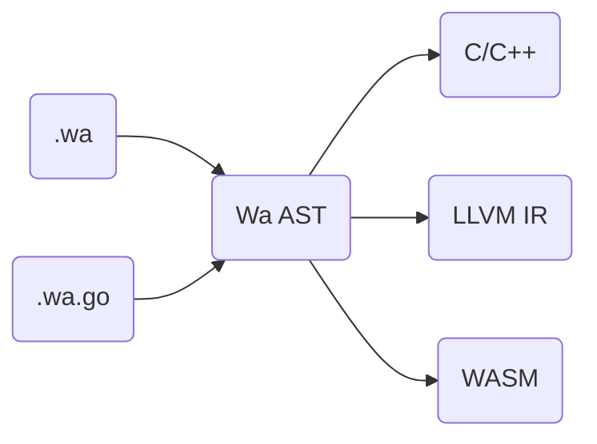

# 凹语言™

[](https://github.com/wa-lang/wa/actions/workflows/wa.yml)
[](https://goreportcard.com/report/github.com/wa-lang/wa)
[](https://coveralls.io/github/wa-lang/wa)
[](https://github.com/wa-lang/wa/releases)

凹语言™（凹读音“Wa”）是[柴树杉](https://github.com/chai2010)、[丁尔男](https://github.com/3dgen)和[史斌](https://github.com/benshi001)设计的实验性编程语言。

```
+---+    +---+
| o |    | o |
|   +----+   |
|            |
|     Wa     |
|            |
+------------+
```

## 设计哲学

- 披着 Go 和 Rust 语法外衣的 C++ 语言；
- 凹语言™源码文件后缀为 `.wa`；
- 凹语言™编译器兼容 WaGo 语法。WaGo 是 μGo 真超集，同时 WaGo 是 Go 真子集。使用 WaGo 语法的源码文件后缀为 `.wa.go`。凹语法与 WaGo 语法在 AST 层面一致；
- 凹语言™支持中文/英文双语关键字，即任一关键字均有中文及英文版，二者在语法层面等价。

## 处理过程



## 例子: 打印素数

打印 30 以内的素数：

```
// 版权 @2021 凹语言™ 作者。保留所有权利。

fn main() {
	for n := 2; n <= 30; n = n + 1 {
		let isPrime int = 1
		for i := 2; i*i <= n; i = i + 1 {
			if x := n % i; x == 0 {
				isPrime = 0
			}
		}
		if isPrime != 0 {
			println(n)
		}
	}
}
```

更多例子: [_examples/hello](_examples/hello)

## 版权

版权 @2019 凹语言™ 作者。保留所有权利。
