<div align="center">
<h1>🇨🇳 凹语言™ The Wa Programming Language</h1>

[主页](https://wa-lang.org) | [Playground](https://wa-lang.org/playground) | [目标](https://wa-lang.org/goals.html) | [路线](https://wa-lang.org/smalltalk/st0002.html) | [社区](https://wa-lang.org/community) | [日志](https://wa-lang.org/changelog.html) | [论坛](https://github.com/wa-lang/wa/discussions)

[Document](https://wa-lang.org) | [Playground](https://wa-lang.org/playground) | [Goals](https://wa-lang.org/goals.html) | [Roadmap](https://wa-lang.org/smalltalk/st0002.html) | [Community](https://wa-lang.org/community) | [Changelog](https://wa-lang.org/changelog.html) | [Discussions](https://github.com/wa-lang/wa/discussions)


</div>
<div align="center">

[](https://github.com/wa-lang/wa/actions/workflows/wa.yml)
[](https://goreportcard.com/report/github.com/wa-lang/wa)
[](https://coveralls.io/github/wa-lang/wa)
[](https://github.com/wa-lang/wa/releases)

</div>

凹语言™（凹读音“Wa”）是 针对 WASM 平台设计的的通用编程语言，支持 Linux、macOS 和 Windows 等主流操作系统和 Chrome 等浏览器环境，同时也支持作为独立Shell脚本和被嵌入脚本模式执行。

Wa is a general-purpose programming language designed for developing robustness and maintainability WebAssembly software.
Instead of requiring complex toolchains to set up, you can simply go install it - or run it in a browser.



- 主页 (Homepage): [https://wa-lang.org](https://wa-lang.org)
- 开发工具 (Develop Tools): [Playground](https://wa-lang.org/playground), [VSCode](https://marketplace.visualstudio.com/items?itemName=xxxDeveloper.vscode-wa)
- 开发组 (Core Team): [柴树杉(chai2010)](https://github.com/chai2010)、[丁尔男(Ending)](https://github.com/3dgen)、[史斌(Benshi)](https://github.com/benshi001)、[扈梦明(xxxDeveloper)](https://github.com/xxxDeveloper)、[刘云峰(leaftree)](https://github.com/leaftree)

安装和测试 (Install and Run):

1. `go install github.com/wa-lang/wa@latest`
2. `wa init -name=_examples/hi`
3. `wa run _examples/hi`

> 项目尚处于原型开源阶段，如果有共建和PR需求请 [入群交流](https://wa-lang.org/community/index.html)。

> The Wa project is still in very early stage. If you want to submit PR, please join the [Wechat Group(Speak Chinese)](https://wa-lang.org/community/index.html) at first.

## 例子: 凹语言 (Example: Print 凹语言)

打印字符和调用函数(Print rune and call function)：

```
fn main() {
	print('凹')
	print('语')
	print('言')
	print('\n')

	println(add(40, 2))
}

fn add(a: i32, b: i32) => i32 {
	return a+b
}
```

运行并输出结果 (Execute the program):

```
$ go run main.go hello.wa 
凹语言
42
```

## 例子: 打印素数 (Example: Print Prime)

打印 30 以内的素数 (Print prime numbers up to 30):

```
# 版权 @2021 凹语言™ 作者。保留所有权利。

fn main() {
	for n := 2; n <= 30; n = n + 1 {
		var isPrime int = 1
		for i := 2; i*i <= n; i = i + 1 {
			if x := n % i; x == 0 {
				isPrime = 0
			}
		}
		if isPrime != 0 {
			println(n)
		}
	}
}
```

运行并输出结果 (Execute the program):

```
$ go run main.go run _examples/prime
2
3
5
7
11
13
17
19
23
29
```

更多例子 (More examples) [_examples](_examples)

## 作为脚本执行 (Execut as a script)

凹语言本身也可以像 Lua 语言被嵌入 Go 宿主语言环境执行 (The Wa language itself can also be executed like the Lua language embedded in the Go host locale):

```go
package main

import (
	"fmt"
	"github.com/wa-lang/wa/api"
)

func main() {
	output, err := api.RunCode("hello.wa", "fn main() { println(40+2) }")
	fmt.Print(string(output), err)
}
```

注：作为脚本执行目前只支持本地环境。(Note: Executing as a script currently only supports native environments.)

## 版权(License)

版权 @2019-2022 凹语言™ 作者。保留所有权利。(Copyrighe @2019-2022 The Wa author. All rights reserved.)
