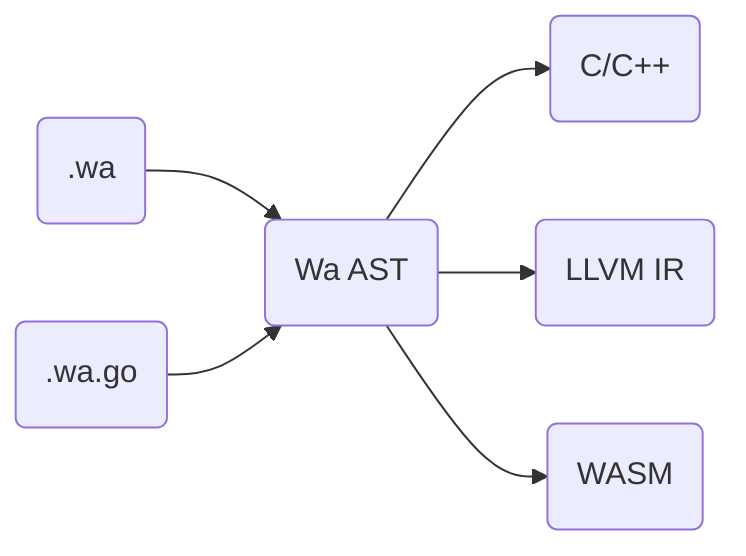

<div align="center">
<p>
    
</p>
<h1>🇨🇳 凹语言™ The Wa Programming Language</h1>

[wa-lang.org](https://wa-lang.org) | [设计目标](https://wa-lang.org/goals.html) | [路线规划](https://wa-lang.org/smalltalk/st0002.html) | [变更日志](https://wa-lang.org/changelog.html)

</div>
<div align="center">

[](https://github.com/wa-lang/wa/actions/workflows/wa.yml)
[](https://goreportcard.com/report/github.com/wa-lang/wa)
[](https://coveralls.io/github/wa-lang/wa)
[](https://github.com/wa-lang/wa/releases)

</div>

凹语言™（凹读音“Wa”）是[柴树杉](https://github.com/chai2010)、[丁尔男](https://github.com/3dgen)和[史斌](https://github.com/benshi001)设计的实验性编程语言。

```
+---+    +---+
| o |    | o |
|   +----+   |
|            |
|     Wa     |
|            |
+------------+
```

安装和测试:

1. 安装 [Clang](https://clang.llvm.org), 确保本地 `clang` 命令有效
2. `go install github.com/wa-lang/wa@latest`
3. `wa init -name=_examples/hi`
4. `wa run _examples/hi`

> 项目尚处于原型开源阶段，如果有共建和PR需求请入群交流。

## 设计目标

- 披着 Go 和 Rust 语法外衣的 C++ 语言；
- 凹语言™源码文件后缀为 `.wa`；
- 凹语言™编译器兼容 WaGo 语法。WaGo 是 Go 真子集。使用 WaGo 语法的源码文件后缀为 `.wa.go`。凹语法与 WaGo 语法在 AST 层面一致；
- 凹语言™支持中文/英文双语关键字，即任一关键字均有中文及英文版，二者在语法层面等价。

更多细节请参考 [凹语言™项目目标](docs/goals.md)

## 处理过程



## 例子: 打印素数

打印 30 以内的素数：

```
// 版权 @2021 凹语言™ 作者。保留所有权利。

函数 main() {
	for n := 2; n <= 30; n = n + 1 {
		变量 isPrime int = 1
		for i := 2; i*i <= n; i = i + 1 {
			if x := n % i; x == 0 {
				isPrime = 0
			}
		}
		if isPrime != 0 {
			println(n)
		}
	}
}
```

运行并输出结果:

```
$ go run main.go run _examples/prime
2
3
5
7
11
13
17
19
23
29
```

## 更多例子

[_examples](_examples)


## QQ群
群号：112919306

## 微信群
群已超过200人，请添加群助手微信号后拉入：


## 版权

版权 @2019 凹语言™ 作者。保留所有权利。

