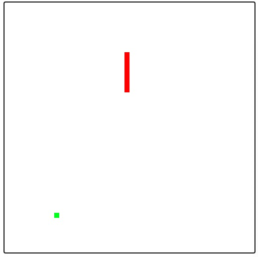

# Build Snake Game with WebAssembly language

Play snake game in browser: https://wa-lang.org/wa/snake/

Or build the game at local:

1. Clone Wa git repo
2. Install Ensure that Go1.17 and Python3
3. cd to the current dir and run `make run`

