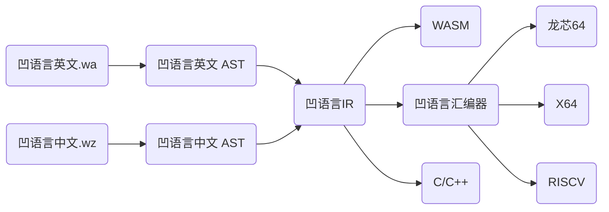

## 凹语言编译器架构

凹语言设计采用中英文双前端，对接到凹语言IR统一的中间表示，后端对接中英文自研汇编器，最终对接到不同的指令集架构, 最终实现全链路自研(没有GCC/LLVM等外部依赖).

```mermaid
graph LR
    wa_ext(凹语言英文.wa);
    wz_ext(凹语言中文.wz);

    wa_ast(凹语言英文 AST);
    wz_ast(凹语言中文 AST);
    
    wair(凹语言IR);

    wasm(WASM);
    nasm(凹语言汇编器);
    c_cpp(C/C++);

    x64(X64);
    loong64(龙芯64);
    riscv(RISCV);

    wa_ext --> wa_ast;
    wz_ext --> wz_ast;

    wa_ast --> wair;
    wz_ast --> wair;

    wair --> wasm
    wair --> nasm
    wair --> c_cpp

    nasm --> loong64
    nasm --> x64
    nasm --> riscv
```

- 注: 其中RISCV平台因为缺少环境, 尚未进行真机测试.
- 注: 凹语言IR 尚在设计完善中, 目前以wasm作为中间IR.

