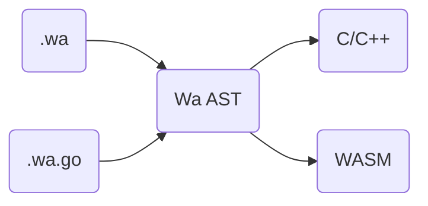

# 凹语言™项目目标

本项目的发起人（柴树杉、丁尔男、史斌）均是Gopher，在开发实践中，因为不同的原因，先后萌生了发展一门新语言的想法，Go 语言克制的风格是我们对于编程语言审美的最大公约数，因此选择它作为初始的蓝本。不必讳言：本项目启动时大量借鉴了 Go 的设计思想和具体实现——这是在有限投入下不得不作出的折衷，我们希望随着项目的发展，积累更多原创的设计，为自主创新的大潮贡献一点力量。

纵观编程界，没有哪门被广泛使用的通用语言诞生于KPI制度之下。本项目作为个人业余项目，不存在明确的指标，从成果分类的角度，我们希望在第一阶段完成以下目标：

- 确定凹语言™语法规则
- 实现可用的凹语言™编译器
- 使用凹语言™创建一个网页应用

---

## 凹语言™特性——预期

凹语言™包含两套相互等价的语法：凹语法与 WaGo 语法，这里“等价”的含义是：二者可生成相同的AST并无损的互相转换。使用凹语法编写的源文件后缀为 `.wa`，使用 WaGo 语法编写的源文件后缀为 `.wa.go`。WaGo 语法是 Go 语法的真子集，换句话说：一个合法的 WaGo 包必然是合法的 Go 包。

网页应用是我们很重视的目标场景，这与 Go 语言把服务端作为主战场截然不同，WaGo 裁减掉的部分多半与此相关：

* WaGo 没有 `go` 关键字，不支持goroutine/并发
* WaGo 没有 `chan` 关键字，不支持与之相关的管道操作
* WaGo 没有全局GC——但**可能**会提供自动RC以尽可能简化内存管理
* WaGo 没有内置标准库——即使有，规模也极其有限

WaGo 的数据类型如下表：

|字符串（string）|数组（array）|切片（slice）|复数（complex）|哈希表（map）|结构体（struct）|
|:-:|:-:|:-:|:-:|:-:|:-:|
|有|有|有|可能有|可能有|有|

WaGo 的其他特性如下表：

|多返回值|方法|方法值|接口|闭包|反射|
|:-:|:-:|:-:|:-:|:-:|:-:|
|有|有|可能无|有|可能有|可能有|

> 各特性的实现可能性从高到底排列为：有 > 可能无 > 可能有 > 无

通过以上描述，大致可以勾勒出 WaGo 的轮廓。凹语法在AST层面与 WaGo 等价的同时，最显著的变化是增加了中文关键字。对于凹语法将来的发展，我们持开放态度。

---

## 凹编译器实现——路线

凹编译器的工作过程如下图所示：

凹编译器支持 C/C++、WASM 等多种输出以满足不同的目标场景。当前阶段的主要任务：
- 创建编译器框架
- 确定前中后端模块间的接口
- 设计能满足语法特性基线的运行时模型

每种后端的进度互相独立，但显然目标代码越底层，需要考虑的细节也越多，因此在落地语法特性时，采用先高级目标后低级目标的顺序有利于问题的逐步降解。

各后端可能的应用场景：

- C/C++：凹语言™与 C/C++ 混合开发
- WASM：直接编译为WebAssembly模块

当任一后端模块覆盖“可用最小集”，我们将尝试开发一些简单的网页示例，待选的方向有交互式图形图像、在线编译等。

---

2022.7.23