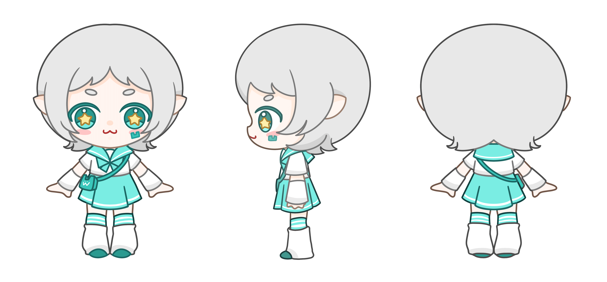

# 凹语言吉祥物——WA酱 角色设定介绍

*设计师：李瑾*

------

## 🌟 角色简介

 **姓名：** WA酱（Wa-chan）  
 **性别：** 女  
 **外貌年龄：** 4岁左右  
 **性格：** 活泼可爱、聪明机智、乐于助人  
 **擅长：** 编程、逻辑推理、跨平台魔法（跨操作系统开发）  
 **愿景：** 让编程变得更加自由、简单，让更多开发者发现凹语言的魅力！

------

## 🎨 设计理念

WA酱是凹语言（The Wa Programming Language）的拟人化吉祥物，形象设计结合了二次元萌系风格与现代科技感，以亲和力、可扩展性、自由精神为核心概念，充分展现凹语言的核心特点。

1️⃣ **科技感配色**：
 主色调采用**浅蓝绿+白色+银灰**，象征凹语言的高效、灵活以及现代感，同时也呼应 WebAssembly 的前沿技术气息。

2️⃣ **智能象征元素**：

- **瞳孔星形高光**：象征 WA 酱的智慧和无限可能，寓意凹语言助力开发者探索新的技术星辰。
- **“W”字形符号**：出现在脸颊和小包上，强化品牌印象，代表凹语言的专属标识。

3️⃣ **服装与风格**：

- 采用经典**水手服+未来感袖口**的搭配，增加可爱度，同时展现程序员精神的严谨与开放。
- 迷你单肩包设计，不仅装可爱，更代表了便捷性和跨平台适配能力（Portable 的特性）。
- 袜子融入了电子线条感的装饰，呼应凹语言的程序世界背景。

------

## 💻 WA酱的个性与背景故事

WA 酱是一名天才程序少女，对代码充满好奇，喜欢尝试新事物。她出生于一个汇聚多种语言的大世界，但她发现许多开发者被繁琐的语法束缚，于是，她立志创造一个简洁、灵活、高效的编程方式，让开发变得更加自由和轻松！

在日常生活中，WA 酱总是活力满满，喜欢和开发者们互动，帮助他们理解凹语言的独特之处。她最大的愿望是让凹语言成为开发者心目中最亲近的编程伙伴，让更多人享受创造的乐趣！

------

## 🌍 未来展望

作为凹语言的代表角色，WA 酱不仅仅是一个吉祥物，她也是连接开发者社区的重要桥梁。她将活跃在文档、教程、周边设计中，甚至可能进入游戏、动画等跨界创作中！未来，她或许还会有不同的皮肤和进阶形态，与开发者们一起成长和进化！

------

## 🚀 让WA酱带你探索凹语言的世界！

不论你是编程新手，还是资深开发者，WA 酱都期待与你一起探索凹语言的无限可能！💙✨

