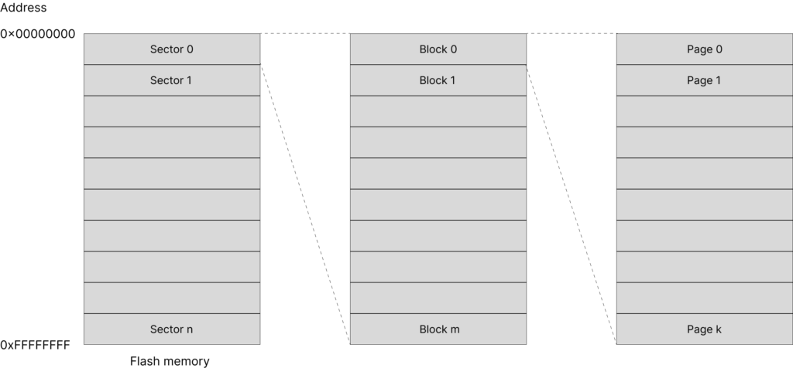
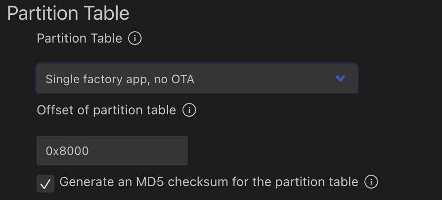

# ESP32 Partition Table

https://www.embeddedexplorer.com/esp32-partition-table/

## Introduction

In this article, we will learn about ESP32 partition table: what it is, why we need partition table, how to create a partition table, how to examine a partition table of a project. Understanding partition table is important when programming ESP32.

## Flash memory

Let's have a brief review on a typically flash memory structure. A flash memory usually is organised in sectors, blocks and pages as illustrated in the below diagram



A flash memory may contains multiple sectors, each sectors may contain multiple blocks, and each blocks may have multiple pages. A page in turn consists of multiple bytes of data. A location of a byte in memory is identified by using a 32-bit address, starting from 0x00000000 to 0xFFFFFFFF.

The [ESP32 DevKitC](https://embeddedexplorer.com/esp32-devkitc/) development board has an external SPI flash integrated on the module with capacity of 4 MB. Data is written to and read from the flash by using Serial Peripheral Interface protocol.

## ESP32 Partition Table

A partition table is a table describing where different pieces of code or data are stored in flash memory. ESP32's flash may contain more than 1 application, and may store different kind of data, e.g. filesystems, WiFi configurations, Bluetooth configuration etc.

The following example describes a typical partition table with a single application, no OTA (over-the-air update)

| Name | Type | Subtype | Offset | Size | Flags |
| ---- | ---- | ------- | ------ | ---- | ----- |
| nvs  | data (0x01) | nvs (0x02) | 0x9000 | 24K |
| phy_init | data (0x01) | phy (0x01) | 0xf000 | 4K |
| factory | app (0x00) | factory (0x00) | 0x10000 | 1M |

Take a close look at this table

- You can see there are several memory regions which are defined in the table
- Each region has a name, a type, a subtype, an offset address, size and (optionally) flags
- There's a region named nvs (non-volatile storage) which stores data resided at an address with offset 0x9000 and is 24 kB of size. nvs may be used, for example, to store wifi data.
- A region named phy_init at address offset 0xf000 and size of 4 kB to store physical layer initialisation data.
- The region contains application code is named factory and stays at address 0x10000 and has a maximum size of 1 MB.

## When is the partition table used

When you are building an ESP32 project, you need to specify a partition table. Examples in ESP-IDF such as get_started, hell_world uses the built in partition table described above. You can find the csv file storing the above partition table at

```
esp-idf/components/partition_table/partitions_singleapp.csv
```

When building your project, ESP-IDF tools will convert this partition table from csv file to binary format and flash the partition table binary at address offset 0x8000 in flash memory.

When [booting up](https://docs.espressif.com/projects/esp-idf/en/latest/esp32/api-guides/startup.html), the second stage bootloader will read the partition table at the default address 0x8000 to find where the application is, then load and execute it.

## Create a partition table

You can use one of the built-in partition tables (single factory app, no OTA or factory app, two OTA definitions) or create a custom partition table as required by your application. You can use menuconfig in Visual Studio Code to select your options



If you create a custom partition table using csv format, refer to the [official documentation](https://docs.espressif.com/projects/esp-idf/en/latest/esp32/api-guides/partition-tables.html) for the meaning of the fields and accepted values. We will revisit partition table again when we discuss about over-the-air update with ESP32 in another article.

ESP-IDF provides a python script to convert a partition table in csv format to binary format and vice versa. The python script is

```
esp-idf/components/partition_table/gen_esp32part.py
```

ESP-IDF also provides another python script (parttool.py) so that on a running ESP32 target, you can read or write a partition and retrieve the partition table. This may be useful during development process.

## Wrapping Up

In this article, you have learnt about partition table in ESP32. Hopefully you understand its roles in building an ESP32 project. Thanks for reading.

