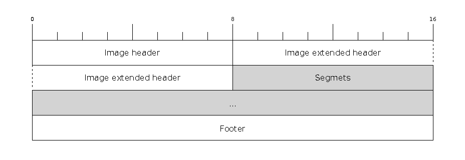
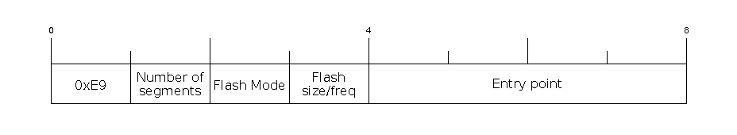
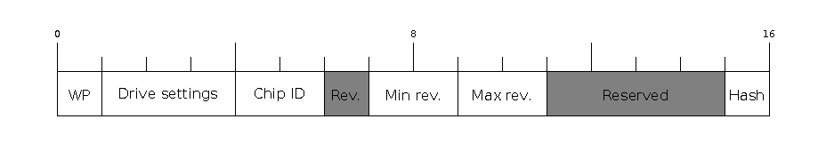

# 固件镜像格式

https://docs.espressif.com/projects/esptool/en/latest/esp32c3/advanced-topics/firmware-image-format.html

本文档是ROM引导程序所使用的固件镜像格式的技术文档。这些是由`esptool elf2image`创建的镜像。

固件文件由头部、扩展头部、可变数量的数据段和尾部组成。多字节字段是小端序。

## 文件头部(Image header)

镜像头部长度为8字节：

| 字节 | 描述 |
| ---- | ----------- |
| 0    | 魔术数字（始终为`0xE9`） |
| 1    | 段数 |
| 2    | SPI Flash模式（0 = QIO，1 = QOUT，2 = DIO，3 = DOUT） |
| 3    | 高四位 - Flash大小（0 = 1MB，1 = 2MB，2 = 4MB，3 = 8MB，4 = 16MB） |
| 3   | 低四位 - Flash频率（0 = 40MHz，1 = 26MHz，2 = 20MHz，0xf = 80MHz） |
| 4-7  | 入口点地址 |

`esptool`根据通过命令行选项提供的SPI闪存信息覆盖第2和第3（从0开始计数）字节（参见: [Flash Modes](https://docs.espressif.com/projects/esptool/en/latest/esp32c3/esptool/flash-modes.html#flash-modes)）。
仅当这是引导程序镜像（写入 0x0 的正确引导程序偏移量的镜像）时，才会覆盖这些字节。
在这种情况下，附加的SHA256摘要（用于验证镜像完整性的加密哈希）也会更新以反映头部变化。
可以通过运行带有`--dont-append-digest`参数的`esptool elf2image`来生成没有SHA256摘要的镜像。

## 扩展文件头部(Image extended header)

| 字节 | 描述 |
| ---- | ----------- |
| 0    | 通过eFuse设置SPI引脚时的WP引脚（由ROM引导程序读取） |
| 1-3  | SPI闪存引脚的驱动设置（由ROM引导程序读取） |
| 4-5  | 芯片ID（此镜像是为哪个ESP设备准备的） |
| 6    | 镜像支持的最低芯片版本（已弃用，请使用以下字段） |
| 7-8  | 镜像支持的最低芯片版本（格式：major * 100 + minor） |
| 9-10 | 镜像支持的最高芯片版本（格式：major * 100 + minor） |
| 11-14 | 附加头部空间中的保留字节，当前未使用 |
| 15 | 附加的哈希（如果为1，则SHA256摘要附加在校验和之后） |

## 段

| 字节 | 描述 |
| ---- | ----------- |
| 0-3  | 内存偏移量 |
| 4-7  | 段大小 |
| 8…n  | 数据 |

## 尾部

文件用零填充，直到其大小比16字节的倍数少1字节。最后一个字节（从而使文件大小成为16的倍数）是所有段数据的校验和。校验和定义为所有字节与字节`0xEF`的异或和。

如果扩展文件头部中的“附加的哈希”为`0x01`，则在校验和之后附加（整个镜像的）SHA256摘要“简单哈希”。此摘要与安全启动分开，仅用于检测损坏。如果镜像后附加了哈希，则在烧写期间不能更改SPI闪存信息。

如果启用了安全启动，还会附加签名（并且简单哈希包含在已签名的数据中）。此镜像签名是[Secure Boot V1](https://docs.espressif.com/projects/esp-idf/en/latest/esp32/security/secure-boot-v1.html#image-signing-algorithm)和[Secure Boot V2](https://docs.espressif.com/projects/esp-idf/en/latest/esp32/security/secure-boot-v2.html#signature-block-format)特定的。

## 分析二进制镜像

要分析二进制镜像并获取其头部和段的完整摘要，请使用[image-info](https://docs.espressif.com/projects/esptool/en/latest/esp32c3/esptool/basic-commands.html#image-info)命令。
