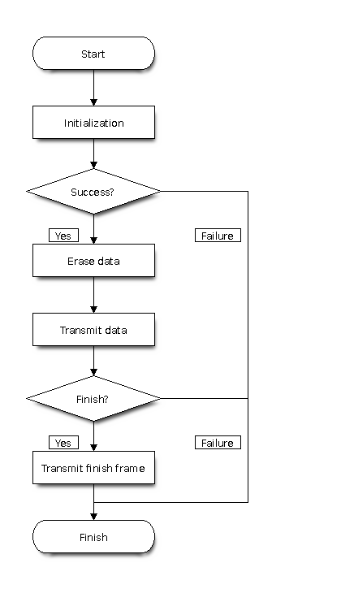
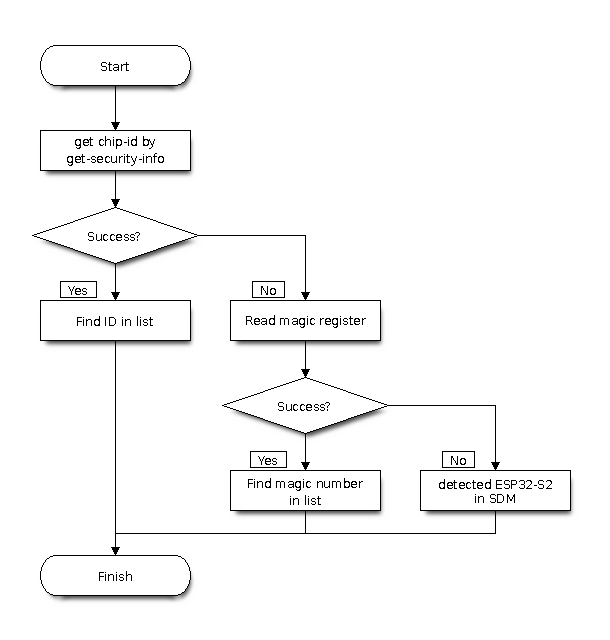

# 串行协议

*https://docs.espressif.com/projects/esptool/en/latest/esp32c3/advanced-topics/serial-protocol.html*

本文档是 ESP32-C3 ROM中的UART引导程序和 [esptool](https://docs.espressif.com/projects/esptool/en/latest/esp32c3/esptool/flasher-stub.html#stub) 程序所使用的串行协议的技术文档。

如果某些 Strapping 引脚被设置，UART 引导程序会在芯片复位时运行。有关此过程的详细信息，请参见 [进入引导程序](https://docs.espressif.com/projects/esptool/en/latest/esp32c3/esptool/entering-bootloader.html#entering-the-bootloader)。

默认情况下，esptool会将一个“软件加载程序”上传到芯片的IRAM中。然后，存根加载程序会替代ROM加载程序进行所有后续交互。这使大部分行为标准化。在esptool中传递`--no-stub`以禁用存根加载程序。有关更多信息，请参见[Flasher stub](https://docs.espressif.com/projects/esptool/en/latest/esp32c3/esptool/flasher-stub.html#stub)。

> 注意：ESP芯片之间的串行协议存在差异！要切换到不同芯片的文档，请从左上角的下拉菜单中选择所需的目标。

## 数据包描述

主机向ESP芯片发送一个[SLIP](https://en.wikipedia.org/wiki/Serial_Line_Internet_Protocol)(串行线路互联网协议)编码的命令请求。ESP芯片响应该请求，返回一个SLIP编码的响应数据包，其中包括状态信息和作为有效载荷的任何数据。

> 注: SLIP协议的规范请参考 [rfc1055.txt](rfc1055.txt)

### 底层协议

引导程序协议在两个方向的数据传输中都使用[SLIP](https://en.wikipedia.org/wiki/Serial_Line_Internet_Protocol)数据包成帧方式。

每个SLIP数据包都以`0xC0`开始和结束。在数据包内部，所有`0xC0`和`0xDB`的出现都分别替换为`0xDB 0xDC`和`0xDB 0xDD`。替换操作要在计算校验和和长度**之后**进行，因此数据包长度可能比下面的`size`字段更长。

### 命令数据包

每个命令都是一个由主机发起的SLIP数据包，并会产生一个响应数据包。在数据包内部，数据包由一个头部和一个可变长度的主体组成。所有多字节字段都是小端序。

| 字节 | 名称 | 注释 |
| ---- | ---- | ------- |
| 0    | 方向 | 请求始终为`0x00` |
| 1    | 命令 | 命令标识符（参见[命令](https://docs.espressif.com/projects/esptool/en/latest/esp32c3/advanced-topics/serial-protocol.html#commands)）。 |
| 2-3  | 大小 | 数据字段的长度（以字节为单位）。 |
| 4-7  | 校验和 | 数据字段部分的简单校验和（仅用于某些命令，参见[校验和](https://docs.espressif.com/projects/esptool/en/latest/esp32c3/advanced-topics/serial-protocol.html#checksum)）。 |
| 8..n | 数据 | 可变长度的数据有效载荷（0-65535字节，由Size参数指示）。用法取决于特定命令。 |

### 响应数据包

每个接收到的命令都会导致ESP芯片向主机发送一个响应SLIP数据包。响应数据包的内容如下：

| 字节 | 名称 | 注释 |
| ---- | ---- | ------- |
| 0    | 方向 | 响应始终为`0x01` |
| 1    | 命令 | 与触发响应的请求数据包中的命令标识符相同的值 |
| 2-3  | 大小 | 数据字段的大小。至少为状态字节的长度（2或4字节，见下文）。 |
| 4-7 | 值 | READ_REG命令使用的响应值（见下文）。其他情况下为零。 |
| 8..n | 数据 | 可变长度的数据有效载荷。长度由“大小”字段指示。 |

#### 状态字节

数据有效载荷的最后几个字节指示命令状态：

对于存根加载程序，最后两个字节指示状态（大多数命令至少返回两个字节的数据有效载荷）：

| 字节 | 名称 | 注释 |
| ---- | ---- | ------- |
| Size-2 | 状态 | 状态标志，成功（0）或失败（1） |
| Size-1 | 错误 | 如果状态为1，则指示错误类型。 |

对于ESP32-C3 ROM（仅ROM，不包括存根加载程序），使用最后四个字节，但只有前两个字节包含状态信息：

| 字节 | 名称 | 注释 |
| ---- | ---- | ------- |
| Size-4 | 状态 | 状态标志，成功（0）或失败（1） |
| Size-3 | 错误 | 如果状态为1，则指示错误类型。 |
| Size-2 | 保留 |  |
| Size-1 | 保留 |  |

#### ROM加载程序错误

ROM加载程序发送以下错误值

| 值 | 含义 |
| ----- | ------- |
| `0x00` | “未定义错误” |
| `0x01` | “输入参数无效” |
| `0x02` | “无法从系统分配内存” |
| `0x03` | “发送消息失败” |
| `0x04` | “接收消息失败” |
| `0x05` | “接收消息的格式无效” |
| `0x06` | “消息正常，但运行结果错误” |
| `0x07` | “校验和错误” |
| `0x08` | “Flash写入错误” - 将数据块写入Flash后，ROM加载程序会读回该值，并将8位CRC与从Flash读取的数据进行比较。如果不匹配，则返回此错误。 |
| `0x09` | “Flash读取错误” - SPI读取失败 |
| `0x0a` | “Flash读取长度错误” - SPI读取请求长度错误 |
| `0x0b` | “Deflate失败错误”（仅压缩上传） |
| `0x0c` | “Deflate Adler32错误” |
| `0x0d` | “Deflate参数错误” |
| `0x0e` | “无效的RAM二进制大小” |
| `0x0f` | “无效的RAM二进制地址” |
| `0x64` | “无效参数” |
| `0x65` | “无效格式” |
| `0x66` | “描述过长” |
| `0x67` | “错误的编码描述” |
| `0x69` | “存储空间不足” |

#### 存根加载程序状态和错误

如果使用存根加载程序：

- 无论芯片类型如何，状态响应始终为2字节。
- 存根加载程序的错误代码与ROM加载程序的代码完全不同。它们都采用`0xC*`的形式，或者`0xFF`表示“未实现的命令”。（[完整列表见此处](https://github.com/espressif/esptool/blob/master/flasher_stub/include/stub_flasher.h#L95)）。

发送命令后，主机应继续读取响应数据包，直到收到一个命令字段与请求的命令字段匹配的数据包，或者超过超时时间。

### 命令

#### 存根加载程序和ROM加载程序均支持

| 字节 | 名称 | 描述 | 输入数据 | 输出数据 |
| ---- | ---- | ----------- | ---------- | ----------- |
| `0x02` | FLASH_BEGIN | 开始Flash下载 | 四个32位字：要擦除的大小、数据包数量、一个数据包中的数据大小、Flash偏移量。仅传递给ROM加载程序的第五个32位字：1表示开始加密Flash，0表示不。 |  |
| `0x03` | FLASH_DATA | Flash下载数据 | 四个32位字：数据大小、序列号、0、0，然后是数据。使用校验和。 |  |
| `0x04` | FLASH_END | 完成Flash下载 | 一个32位字：0表示重启，1表示运行用户代码。如果希望留在加载程序中，则无需发送此命令 |  |
| `0x05` | MEM_BEGIN | 开始RAM下载 | 总大小、数据包数量、一个数据包中的数据大小、内存偏移量 |  |
| `0x06` | MEM_END | 完成RAM下载 | 两个32位字：执行标志、入口点地址 |  |
| `0x07` | MEM_DATA | RAM下载数据 | 四个32位字：数据大小、序列号、0、0，然后是数据。使用校验和。 |  |
| `0x08` | SYNC | 同步帧 | 36字节：0x07 0x07 0x12 0x20，后跟32个0x55 |  |
| `0x09` | WRITE_REG | 写入32位内存地址 | 四个32位字：地址、值、掩码和延迟（以微秒为单位） |  |
| `0x0a` | READ_REG | 读取32位内存地址 | 地址，作为32位字 | 读取的数据作为值字段中的32位字。 |
| `0x0b` | SPI_SET_PARAMS | 配置SPI闪存 | 六个32位字：id、总大小（字节）、块大小、扇区大小、页大小、状态掩码。 |  |
| `0x0d` | SPI_ATTACH | 连接SPI闪存 | 32位字：0表示普通SPI闪存。仅传递给ROM加载程序的第二个32位字（应为0）。 |  |
| `0x0f` | CHANGE_BAUDRATE | 更改波特率 | 两个32位字：新波特率，如果是与ROM加载程序通信则为0，如果是与存根加载程序通信则为当前/旧波特率。 |  |
| `0x10` | FLASH_DEFL_BEGIN | 开始压缩Flash下载 | 四个32位字：未压缩大小、数据包数量、数据包大小、Flash偏移量。对于存根加载程序，未压缩大小是要写入的确切字节数，而在ROM引导程序上，它会向上舍入到Flash擦除块大小。仅传递给ROM加载程序的第五个32位字：1表示开始加密Flash，0表示不。 |  |
| `0x11` | FLASH_DEFL_DATA | 压缩Flash下载数据 | 四个32位字：数据大小、序列号、0、0，然后是数据。使用校验和。 | 校验和错误时返回错误代码0xC1。 |
| `0x12` | FLASH_DEFL_END | 结束压缩Flash下载 | 一个32位字：0表示重启，1表示运行用户代码。如果希望留在加载程序中，则无需发送此命令。 |  |
| `0x13` | SPI_FLASH_MD5 | 计算Flash区域的MD5 | 四个32位字：地址、大小、0、0 | 主体包含16字节原始MD5，后跟2个状态字节（存根加载程序）或32个十六进制编码的ASCII（ROM加载程序）计算出的MD5 |
| `0x14` | GET_SECURITY_INFO | 读取芯片安全信息 |  | 32位标志、1字节flash_crypt_cnt、7个1字节key_purposes、32位字chip_id、32位字eco_version |

#### 仅存根加载程序支持

ROM加载程序不会识别这些命令。

| 字节 | 名称 | 描述 | 输入 | 输出 |
| ---- | ---- | ----------- | ----- | ------ |
| `0xd0` | ERASE_FLASH | 擦除整个Flash芯片 |  |  |
| `0xd1` | ERASE_REGION | 擦除Flash区域 | 两个32位字：要擦除的Flash偏移量、擦除大小（字节）。两者都必须是Flash扇区大小的倍数。 |  |
| `0xd2` | READ_FLASH | 读取Flash | 四个32位字：Flash偏移量、读取长度、Flash扇区大小、读取数据包大小、最大未确认数据包数 |  |
| `0xd3` | RUN_USER_CODE | 退出加载程序并运行用户代码 |  |  |

#### 安全下载模式支持

安全下载模式是Espressif芯片上可用的ROM加载程序的受限版本。它只允许有限的一组命令：

- 同步（`SYNC`）
- 连接SPI闪存（`SPI_ATTACH`）
- 更新SPI配置（`SPI_SET_PARAMS`）
- 更改波特率（`CHANGE_BAUDRATE`）
- 基本Flash写入（`FLASH_BEGIN`、`FLASH_DATA`、`FLASH_END`）
- 读取当前启用的安全功能的摘要（`GET_SECURITY_INFO`）

任何其他命令（例如，读取或写入内存、通过加载到RAM执行任意代码等）都将导致错误。

您可以在[ESP-IDF安全概述](https://docs.espressif.com/projects/esp-idf/en/stable/esp32c3/security/security.html#uart-download-mode)中阅读有关安全下载模式的更多信息。

### 校验和

除了MEM_DATA、FLASH_DATA和FLASH_DEFL_DATA之外，所有命令的校验和字段都被忽略（可以为零）。

每个`_DATA`命令数据包（如`FLASH_DEFL_DATA`、`MEM_DATA`）都具有相同的“数据有效载荷”格式：

| 字节 | 名称 | 格式 |
| ----- | ---- | ------ |
| 0-3 | “要写入的数据”长度 | 小端32位字。 |
| 4-7 | 序列号 | 小端32位字。序列号从0开始。 |
| 8-15 | 0 | 两个全零字，未使用。 |
| 16- | “要写入的数据” | 长度在有效载荷开头给出。 |

校验和仅应用于这个最后的“要写入的数据”部分，而不是数据的前16个字节。

计算校验和时，从种子值 `0xEF` 开始，对“要写入的数据”中的每个字节进行XOR运算。8位结果存储在数据包头的校验和字段中（作为小端32位值）。

> 注意：由于此校验和不足以确保数据有效，因此添加了SPI_FLASH_MD5命令以在闪存后验证闪存内容。建议始终使用此命令。参见下面的[验证上传的数据](https://docs.espressif.com/projects/esptool/en/latest/esp32c3/advanced-topics/serial-protocol.html#verifying-uploaded-data)。

## 功能描述

> 注意：此流程图用于说明下载过程（写入Flash），其他命令有不同的流程。

### 初始化 - 芯片类型检测

- ESP芯片复位进入UART引导程序模式。主机首先发送SYNC命令。这些命令具有较大的数据有效载荷，ESP芯片也使用该有效载荷来检测配置的波特率。ESP32-C3始终以115200bps初始化。但是，可以以任何波特率发送同步数据包，UART外设将检测到这一点。
- 主机应等待，直到看到对SYNC命令的有效响应，表明ESP芯片正在正确通信。
- 然后，芯片类型检测使用各种方法来识别芯片类型、子类型、版本等。见下文。
- 然后，Esptool（默认情况下）使用“RAM下载”序列将[存根加载程序](https://docs.espressif.com/projects/esptool/en/latest/esp32c3/esptool/flasher-stub.html#stub)代码上传到芯片的IRAM。MEM_END命令包含运行存根加载程序的入口点地址。然后，存根加载程序发送一个自定义的SLIP数据包序列OHAI（`0xC0 0x4F 0x48 0x41 0x49 0xC0`），表明它正在运行。这是ESP发送的唯一未经请求的数据包。如果向esptool提供`--no-stub`参数，则会跳过整个步骤。
- 对于需要使用Flash的命令，ESP32-C3 ROM和存根加载程序需要SPI_ATTACH和SPI_SET_PARAMS命令。参见[SPI配置](https://docs.espressif.com/projects/esptool/en/latest/esp32c3/advanced-topics/serial-protocol.html#spi-configuration-commands)命令。
- 对于存根加载程序和/或ESP32-C3 ROM加载程序，主机可以发送CHANGE_BAUD命令将波特率设置为明确的值。与在SYNC脉冲期间自动检测相比，这在设置非常高的波特率时更可靠。Esptool尝试以（最大）115200bps同步，然后发送此命令以切换到更高的波特率（如果请求）。

### 初始化 - 芯片类型检测

#### ESP32-C3芯片检测

通过使用GET_SECURITY_INFO（0x14）命令及其芯片ID值来检测ESP32-C3。

#### 所有芯片的检测概述

在不支持GET_SECURITY_INFO（0x14）命令（该命令提供芯片ID）的旧设备上，esptool会回退到读取魔术寄存器来确定芯片类型。

主要例外是ESP32-S2：尽管它支持GET_SECURITY_INFO（0x14）命令，但其输出缺少芯片ID。因此，esptool也为此芯片使用魔术寄存器作为回退。如果读取寄存器也失败，则表明芯片处于安全下载模式。

有关详细信息，请参见：[esptool芯片检测代码](https://github.com/espressif/esptool/blob/v5.0.2/esptool/cmds.py#L101)

### 写入数据

（包括RAM下载、Flash下载、压缩Flash下载。）

- RAM下载（MEM_BEGIN、MEM_DATA、MEM_END）将数据加载到ESP芯片内存空间中，并（可选）执行它。
- Flash下载（FLASH_BEGIN、FLASH_DATA）将数据闪存到ESP SPI闪存中。
- 压缩Flash下载与此类似，只是数据使用gzip Deflate算法进行压缩，以减少串行开销。

这三个序列都遵循类似的模式：

- 发送一个_BEGIN命令（FLASH_BEGIN等），其中包含Flash擦除大小、要写入的起始地址等基本参数。上传器还需要指定要发送多少个“数据块”（即单个数据包），以及每个数据包的大小。
- 发送一个或多个_DATA命令（FLASH_DATA等），其中数据有效载荷包含要写入Flash/RAM的实际数据。在压缩Flash下载的情况下，数据使用gzip deflate算法进行压缩。_DATA命令的数量以及每个_DATA有效载荷的大小在_BEGIN命令中指定。最后一个数据块应使用0xFF字节填充到块大小。
- 发送一个_END命令（FLASH_END等）以退出引导程序，并可选地重置芯片（或者在MEM_END的情况下跳转到RAM中的地址）。如果希望继续发送其他或不同的命令，则无需在闪烁后发送。

在发送写入Flash等命令之前，不必发送Flash擦除命令。ROM加载程序响应FLASH_BEGIN命令擦除要写入的区域。存根加载程序在写入数据时进行即时擦除，以最大限度地提高整体闪烁性能（每个数据块通过串行读入RAM，同时前一个块同时写入Flash，并且在写入Flash之前根据需要执行4KB和64KB擦除）。

选择的块大小应足够小以适应设备的RAM。Esptool使用16KB，这在与存根加载程序一起使用时具有良好的性能。

#### 验证上传的数据

上传协议中使用的8位校验和不足以确保上传后Flash内容有效。上传器应发送SPI_FLASH_MD5命令或使用其他方法来验证Flash内容。

SPI_FLASH_MD5命令传递Flash中的起始地址和要计算的数据大小。MD5值在响应有效载荷中返回，位于状态字节之前。

请注意，ESP32-C3 ROM加载程序以32个十六进制编码的ASCII字节返回md5sum，而存根加载程序以16个原始数据字节的MD5返回md5sum，后跟2个状态字节。

### SPI配置命令

#### SPI连接命令

SPI_ATTACH命令启用SPI闪存接口。它采用32位数据有效载荷，用于确定应使用哪个SPI外设和引脚连接到SPI闪存。

在ESP32-C3存根加载程序上，在与SPI闪存交互之前发送此命令是可选的。在ESP32-C3 ROM加载程序上，在与SPI闪存交互之前必须发送此命令。

| 值 | 含义 |
| ----- | ------- |
| 0     | 默认SPI闪存接口 |
| 1     | HSPI接口 |
| （其他值） | 引脚号作为6位值，打包成30位值。顺序（从MSB开始）：HD引脚、Q引脚、D引脚、CS引脚、CLK引脚。 |

“默认SPI闪存接口”使用通过SPI_PAD_CONFIG_xxx eFuses配置的引脚（如果未设置，这些eFuses均为零，并使用数据手册中给出的默认SPI闪存引脚。）

当将每个引脚的值作为6位数字打包到数据字中时，每个6位值使用以下表示：

仅在ESP32-C3 ROM加载程序上，此命令的数据有效载荷中有额外的4个字节。这些字节都应设置为零。

#### SPI设置参数

SPI_SET_PARAMS命令设置所连接的SPI闪存芯片的一些参数（大小等）。

传递的所有值（除了总大小）都是硬编码的，并且大多数在写入Flash时不使用。参见esptool中的flash_set_parameters函数以了解它发送的值。

### 32位读写

32位读写命令（READ_REG、WRITE_REG）允许面向字的内存和寄存器数据读写。

这些命令可用于以任意方式操作外设。例如，esptool的“flash id”功能是通过操作SPI外设寄存器向闪存芯片发送JEDEC闪存ID命令并读取响应来实现的。

### 读取Flash

存根加载程序实现了READ_FLASH命令。此命令的行为与其他命令不同，包括ROM加载程序的READ_FLASH命令：

- 主机发送READ_FLASH命令，数据有效载荷包含偏移量、读取大小、每个单独数据包的数据大小以及一次可以在传输中的“未确认”数据包的最大数量。
- 存根加载程序将发送一个标准响应数据包，没有额外的数据有效载荷。
- 现在，存根加载程序将开始发送带有原始数据（大小在命令中请求）的SLIP数据包。这些SLIP数据包中不包含元数据。
- 收到每个SLIP数据包后，主机应发送回一个4字节的原始SLIP确认数据包，其中包含已接收的总字节数。这些SLIP数据包中没有头部或其他元数据。
- 存根加载程序可以发送最多（由主机在READ_FLASH命令中指定的）最大数量的数据数据包，然后再等待第一个确认数据包。任何时候未确认的数据包都不能超过此“最大在途”限制。
- 所有数据包都被确认接收后，存根加载程序发送一个16字节的所有从Flash读取的数据的MD5摘要。这也作为原始SLIP数据包发送，没有元数据。

读取Flash过程完成后，存根加载程序返回到正常的命令/响应操作。

ROM加载程序的读取Flash命令更正常，但读取数据也慢得多。

## 跟踪Esptool串行通信

esptool有一个--trace选项，可以在第一组参数中提供（在命令之前）。这将把通过串行端口发送和接收的所有流量转储到控制台。

以下是一个示例提取物，显示READ_REG命令和响应：

    TRACE +0.000   --- Cmd READ_REG (0x0a) | data_len 4 | wait_response 1 | timeout 3.000 | data 00100040 ---
    TRACE +0.000   Write 14 bytes:       c0000a04000000000000100040c0
    TRACE +0.046   Read 1 bytes:         c0
    TRACE +0.000   Read 11 bytes:        010a0200090000000000c0
    TRACE +0.000   Received full packet: 010a0200090000000000

+X.XXX值是自上一条跟踪线以来的时间增量（以秒为单位）。

值以十六进制打印。如果一次打印超过16个字节，则使用拆分显示，左侧为十六进制字节，右侧为ASCII：

请注意，日志中表示了多个协议层。“Write X bytes”行显示“通过线路”发送的确切字节，包括SLIP成帧。类似地，“Read X bytes”行显示通过线路读取的字节，包括任何SLIP成帧。一旦读取了完整的SLIP数据包，相同的字节（作为去除了任何转义的SLIP有效载荷）会出现在“Received full packet”日志行中。

以下是第二个示例，显示初始同步序列的一部分（许多0x55字节，在ASCII中为`U`）：

    TRACE +0.000   Write 46 bytes:
      c000082400000000 0007071220555555 | ...$........ UUU
      5555555555555555 5555555555555555 | UUUUUUUUUUUUUUUU
      5555555555555555 5555555555c0     | UUUUUUUUUUUUU.
    TRACE +0.012   Read 1 bytes:         c0
    TRACE +0.000   Read 63 bytes:
      0108040007071220 00000000c0c00108 | ....... ........
      0400070712200000 0000c0c001080400 | ..... ..........
      0707122000000000 c0c0010804000707 | ... ............
      122000000000c0c0 01080400070712   | . .............
    TRACE +0.000   Received full packet: 010804000707122000000000
    TRACE +0.000   Received full packet: 010804000707122000000000

> 重要提示：如果您不打算使用esptool存根加载程序，请传递`--no-stub --trace`以仅查看与芯片内置ROM加载程序的交互。否则，跟踪将显示加载程序的完整二进制上传。

除了此跟踪功能外，大多数操作系统都具有“系统调用跟踪”或“端口跟踪”功能，可用于转储串行交互。

