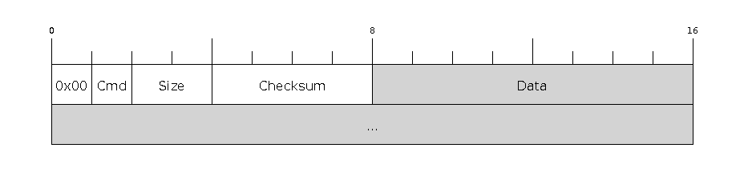
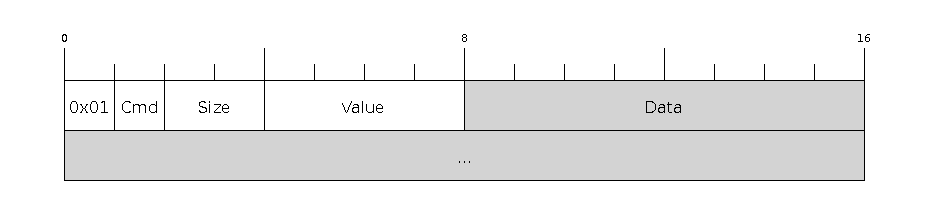

# Serial Protocol

https://docs.espressif.com/projects/esptool/en/latest/esp32c3/advanced-topics/serial-protocol.html

This is technical documentation for the serial protocol used by the UART bootloader in the {IDF_TARGET_NAME} ROM and the esptool [stub loader](https://docs.espressif.com/projects/esptool/en/latest/esp32c3/esptool/flasher-stub.html#stub) program.

The UART bootloader runs on chip reset if certain strapping pins are set. See [Entering-the-bootloader](https://docs.espressif.com/projects/esptool/en/latest/esp32c3/esptool/entering-bootloader.html#entering-the-bootloader) for details of this process.

By default, esptool uploads a stub "software loader" to the IRAM of the chip. The stub loader then replaces the ROM loader for all future interactions. This standardizes much of the behavior. Pass ``--no-stub`` to esptool in order to disable the stub loader. See [Flasher stub](https://docs.espressif.com/projects/esptool/en/latest/esp32c3/esptool/flasher-stub.html#stub) for more information.

> Note: There are differences in the serial protocol between ESP chips! To switch to documentation for a different chip, choose the desired target from the dropdown menu in the upper left corner.

## Packet Description

The host computer sends a SLIP encoded command request to the ESP chip. The ESP chip responds to the request with a SLIP encoded response packet, including status information and any data as a payload.

## Low Level Protocol

The bootloader protocol uses [SLIP](https://en.wikipedia.org/wiki/Serial_Line_Internet_Protocol) packet framing for data transmissions in both directions.

Each SLIP packet begins and ends with `0xC0`. Within the packet, all occurrences of `0xC0` and `0xDB` are replaced with `0xDB 0xDC` and `0xDB 0xDD`, respectively. The replacing is to be done **after** the checksum and lengths are calculated, so the packet length may be longer than the `size` field below.

## Command Packet

Each command is a SLIP packet initiated by the host and results in a response packet. Inside the packet, the packet consists of a header and a variable-length body. All multi-byte fields are little-endian.

| Byte | Name | Comment |
| ---- | ---- | ------- |
| 0    | Direction | Always `0x00` for requests
| 1    | Command | Command identifier (see [Commands](https://docs.espressif.com/projects/esptool/en/latest/esp32c3/advanced-topics/serial-protocol.html#commands)).
| 2-3  | Size | Length of Data field, in bytes.
| 4-7  | Checksum | Simple checksum of part of the data field (only used for some commands, see [Checksum](https://docs.espressif.com/projects/esptool/en/latest/esp32c3/advanced-topics/serial-protocol.html#checksum)).
| 8..n | Data | Variable length data payload (0-65535 bytes, as indicated by Size parameter). Usage depends on specific command.

## Response Packet

Each received command will result in a response SLIP packet sent from the ESP chip to the host. Contents of the response packet is:

| Byte | Name | Comment |
| ---- | ---- | ------- |
| 0    | Direction | Always `0x01` for responses
| 1    | Command | Same value as Command identifier in the request packet that triggered the response
| 2-3  | Size | Size of data field. At least the length of the Status Bytes (2 or 4 bytes, see below).
| 4-7 | Value | Response value used by READ_REG command (see below). Zero otherwise.
| 8..n | Data | Variable length data payload. Length indicated by “Size” field.

## Status Bytes

The final bytes of the Data payload indicate command status:

For stub loader the final two bytes indicate status (most commands return at least a two byte Data payload):

| Byte | Name | Comment |
| ---- | ---- | ------- |
| Size-2 | Status | Status flag, success (0) or failure (1)
| Size-1 | Error | If Status is 1, this indicates the type of error.

For ESP32-C3 ROM (only, not the stub loader) the final four bytes are used, but only the first two bytes contain status information:

| Byte | Name | Comment |
| ---- | ---- | ------- |
| Size-4 | Status | Status flag, success (0) or failure (1)
| Size-3 | Error | If Status 1, this indicates the type of error.
| Size-2 | Reserved
| Size-1 | Reserved

## ROM Loader Errors

The ROM loader sends the following error values

| Value | Meaning |
| ----- | ------- |
| `0x00` | “Undefined errors”
| `0x01` | “The input parameter is invalid”
| `0x02` | “Failed to malloc memory from system”
| `0x03` | “Failed to send out message”
| `0x04` | “Failed to receive message”
| `0x05` | “The format of the received message is invalid”
| `0x06` | “Message is ok, but the running result is wrong”
| `0x07` | “Checksum error”
| `0x08` | “Flash write error” - after writing a block of data to flash, the ROM loader reads the value back and the 8-bit CRC is compared to the data read from flash. If they don’t match, this error is returned.
| `0x09` | “Flash read error” - SPI read failed
| `0x0a` | “Flash read length error” - SPI read request length is wrong
| `0x0b` | “Deflate failed error” (compressed uploads only)
| `0x0c` | “Deflate Adler32 error”
| `0x0d` | “Deflate parameter error”
| `0x0e` | “Invalid RAM binary size”
| `0x0f` | “Invalid RAM binary address”
| `0x64` | “Invalid parameter”
| `0x65` | “Invalid format”
| `0x66` | “Description too long”
| `0x67` | “Bad encoding description”
| `0x69` | “Insufficient storage”

## Stub Loader Status & Error

If the stub loader is used:

- The status response is always 2 bytes regardless of chip type.
- Stub loader error codes are entirely different to the ROM loader codes. They all take the form `0xC*`, or `0xFF` for "unimplemented command". ([Full list here](https://github.com/espressif/esptool/blob/master/flasher_stub/include/stub_flasher.h#L95)).

After sending a command, the host should continue to read response packets until one is received where the Command field matches the request's Command field, or a timeout is exceeded.

## Commands

### Supported by Stub Loader and ROM Loader

TODO
