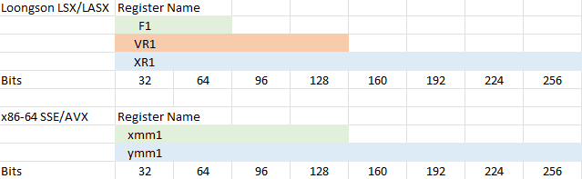
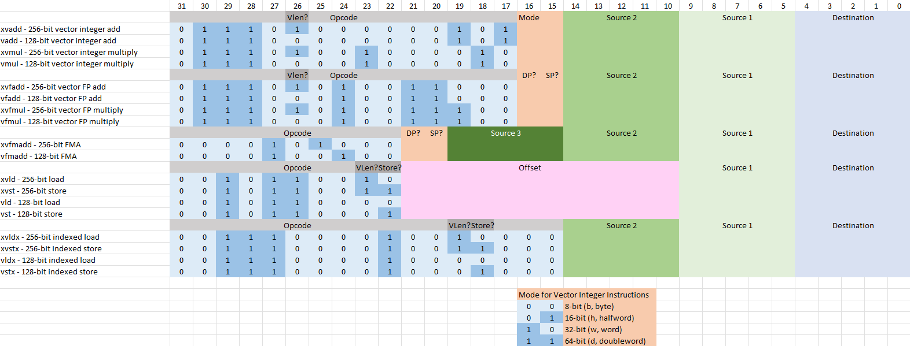
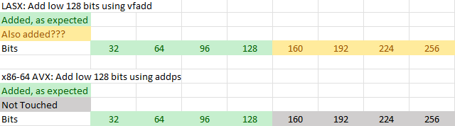
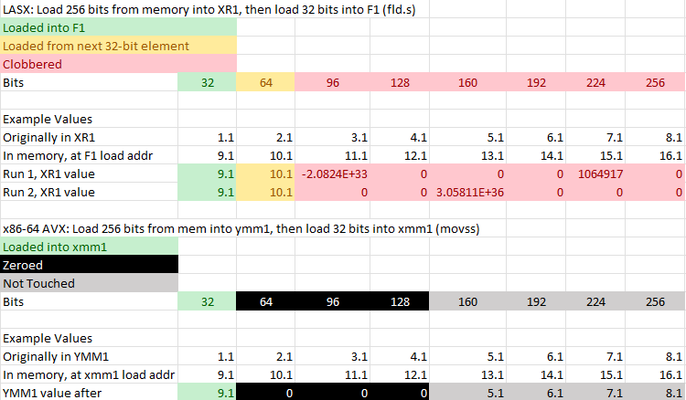
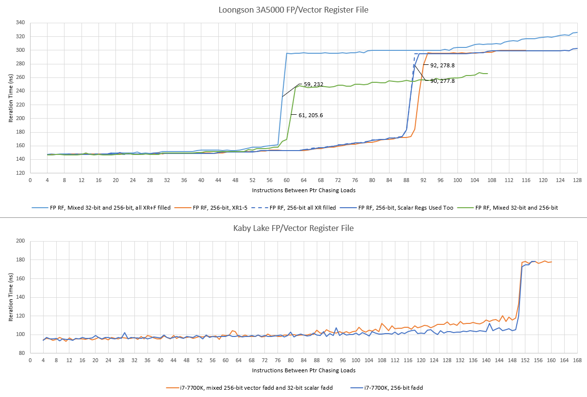
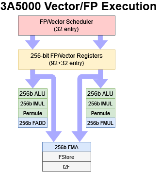

# 龙芯的LSX和LASX矢量扩展指令

- *Chester Lam 2023*
- *https://chipsandcheese.com/p/loongsons-lsx-and-lasx-vector-extensions*

龙芯过去曾基于MIPS指令集架构（ISA）设计处理器，但该公司近期已转向自主研发的LoongArch架构。这款“全新”架构保留了MIPS的诸多语义特征，却采用了互不兼容的编码方式。同时，LoongArch通过架构扩展，更好地支撑了龙芯打造具备市场竞争力的国产CPU这一核心目标。

LoongArch的LSX和LASX向量扩展指令集便是这一扩展思路的典型体现。LSX类似x86架构的SSE指令集，配备128位向量寄存器及相应指令；LASX则可与AVX2对标，二者均支持256位向量操作。与SSE和AVX2不同的是，LSX和LASX暂无公开文档。不过，龙芯自主研发的Loongnix操作系统提供了支持LSX/LASX的工具链，这意味着我们能够通过该工具链探索这些指令的功能并进行实操验证。由于笔者暂无足够时间对这些架构扩展指令进行完整文档梳理，本文将仅分享部分有趣的技术细节。

## 一、简要介绍

LSX提供128位寄存器，命名为VR0至VR31；LASX则提供256位寄存器，命名为XR0至XR31。与SSE和AVX指令集类似，这些寄存器存在别名映射关系，且均与64位浮点寄存器（F0至F31）相关联——具体而言，F1对应XR1的低64位，VR1对应XR1的低128位。

*技术说明：龙芯LASX与x86-64 AVX架构中不同寄存器名映射至同一物理寄存器的示例。通过F1、VR1或XR1等不同命名，可访问同一寄存器的不同位宽部分。*

LSX和LASX均提供了丰富的向量操作指令。向量加法、乘法、逻辑运算等常用操作的功能与预期完全一致：浮点指令可处理FP32（32位浮点）或FP64（64位浮点）类型元素，整数指令则支持8位、16位、32位或64位整数元素；此外，两者也配备了128位和256位的加载/存储指令。

除算术运算指令外，LASX还包含置换（permute）、最小值/最大值（min/max）、绝对值（absolute value）以及加载-广播（load-and-broadcast，因未知原因命名为XVLDREPL）等指令。其中部分指令在AVX2中并无直接对应的功能实现，例如最大值指令的一个变体XVMAXI——该指令接收一个立即数，计算该立即数与向量中对应位置各元素的最大值并返回。值得注意的是，该指令通过5位字段将立即数编码为补码有符号数，这意味着其可编码的数值范围限制在15（上限）至-15（下限）之间。在数据移动方面，LASX提供了可将指定向量通道中的值移动至内存或通用寄存器（GPRs）的专用指令。

仍有大量指令笔者未进行测试，但初步来看，其向量操作覆盖度较为可观。不过部分特定功能仍存在缺失，例如用于视频编码加速的绝对差值和（sum of absolute differences）指令。

## 二、指令编码示例

与MIPS架构将寄存器字段编码在指令中间不同，LoongArch将寄存器字段移至最低有效位，这一设计同样适用于LSX和LASX指令。延续MIPS的设计传统，LSX/LASX指令采用非破坏性语义，即无需覆盖任一源寄存器。这意味着融合乘法（fused multiply）操作与FMA4指令功能相当，需占用四个寄存器字段。由于LoongArch与MIPS一致采用32位定长指令，其操作码字段采用可变长度设计，以支持编码超过三个寄存器操作数。

*技术说明：通过工具链生成LSX/LASX指令并反汇编后，推测出的指令编码结构。*

部分情况下，LSX和LASX的操作码仅相差1位，这一位很可能用于标识指令目标向量长度（128位或256位），但该规则并非普遍适用。在某些场景中，操作码紧邻的几位用于指定数据类型。

与MIPS后续版本类似，LoongArch也配备了用于数组操作的索引加载指令，龙芯将这类指令整合进了LASX和LSX扩展指令集中。但值得注意的是，LoongArch仍不支持在单条指令中同时指定基址、索引和比例因子——x86和ARM架构均支持这一功能，使得数组访问可通过更少指令完成。

通过实验发现，LASX在部分寄存器访问方面存在一些特殊语义。本文暂不对此进行全面分析，仅列举部分典型案例。

## 三、部分寄存器访问

首先，128位LSX算术指令会对整个256位LASX寄存器进行操作。例如，VFADD.S（对128位VR寄存器中的压缩FP32元素执行加法）和VADD.W（对128位向量寄存器中的32位整数执行压缩加法）这两条指令，都会同时对256位寄存器的高128位部分执行加法操作。这意味着，尽管128位算术指令（如VFADD）与256位等效指令（如XVFADD）的操作码不同，但实际执行效果完全一致。这与x86架构的行为形成鲜明对比：在x86架构中，对256位向量执行128位操作时，寄存器高半部分内容会保持不变。

若从内存加载数据至部分寄存器别名，情况则更为特殊。同样，x86架构会保留寄存器高半部分内容，但标量浮点加载会将128位寄存器的高位清零；而在龙芯处理器中，寄存器其余部分的结果是未定义且极具随机性的——这种未定义行为本身颇具研究价值。

龙芯LoongArch参考手册明确指出，使用FLD.S指令后，64位浮点寄存器的高32位内容未定义。FLD.S指令从内存加载一个FP32值并存储至目标寄存器的低32位，其余位本应未定义，但实际测试中，其接下来的32位通常会被内存中后续32位的值填充。这表明龙芯处理器的内存子系统原生支持64位粒度的访问，而非为更小粒度访问设计。

*技术说明：通过向向量寄存器加载256位数据、执行部分访问，再将整个256位寄存器值写回内存的测试过程。*

64位以上部分的结果则完全随机：有时对应元素为零，有时为无效数据（垃圾值），甚至FLD.S指令会被当作完整的256位加载指令执行。

若将FLD.S加载操作推向16KB页面的末尾（此时继续加载数据会跨越页面边界），则32至63位的结果也会变得极不稳定——最常见的结果是该部分为零或从缓存行起始位置加载数据，有时还会加载额外多个元素；更罕见的情况下，部分元素会从完全随机的位置加载，包括下一个页面中的有效内存地址。

在3A5000处理器上，若先填充一个256位寄存器，再尝试通过VLD（128位向量加载）单独填充其低半部分，也会出现类似的特殊行为：VLD指令往往会表现出XVLD指令的特性，即向整个向量寄存器加载256位数据；若高128位数据跨越页面边界，结果同样会变得更加随机。

龙芯3A5000会记录寄存器当前存储的是128位还是256位数据。一旦确定，对向量寄存器低位执行的操作会对高位产生不可预测的影响。龙芯可能将向量寄存器高位视为“部分寄存器操作后的未定义区域”，理论上这种设计有助于提升性能或简化架构设计。相比之下，部分x86 CPU在对向量寄存器低半部分操作时，为保留高位内容可能会产生性能损耗——例如Sandy Bridge架构在切换至“保存AVX YMM寄存器高位的状态”或从中切换时，可能会产生70个时钟周期的延迟。

但龙芯也为此付出了其他代价：若标量浮点操作与向量操作同时使用，浮点/向量重命名容量会减少约32个条目。尽管寄存器存在别名映射关系（F0-F31与XR0-XR31对应同一架构寄存器），但处理器核心似乎需要为两类寄存器分别存储状态。不过这一情况仍优于Sandy Bridge——后者在混合标量与向量操作时，浮点重命名容量会大幅下降；而Skylake等较新架构则完全不会受到重排序容量的影响。

## 四、3A5000的向量性能

龙芯3A5000是目前唯一支持LSX/LASX指令集的处理器，因此本文将重点分析其浮点运算单元（FPU）及向量实现方案。3A5000配备双端口FPU，原生支持256位执行，其执行单元和寄存器均为256位宽。为满足执行单元的数据需求，一级数据缓存（L1D）每周期可处理两次256位访问（支持两次加载，或一次加载+一次存储）。与Zen 1架构不同，3A5000无需将256位指令拆分为两个128位微操作。

向量整数和逻辑操作可利用两个执行通道，加法、按位运算等简单操作的延迟仅为1个时钟周期；置换、整数乘法等复杂操作的延迟为3至4个时钟周期，性能表现较为出色。但在浮点操作方面，向量单元的能力相对有限：浮点加法和乘法分别使用专用通道，这一设计与Sandy Bridge及更早架构类似。龙芯3A5000支持FMA（融合乘加）操作，但两个通道共享一个FMA单元——这一设计允许FMA操作与浮点加法或浮点乘法并行执行，但当浮点加法、乘法与FMA指令混合执行时，无法达到2条指令/周期（IPC）的峰值吞吐量，这可能是由于通道分配不够优化以及FMA单元的资源竞争导致。

浮点执行单元通常比整数单元体积更大、功耗更高。龙芯的设计策略可能更侧重于实现256位向量长度带来的优势，而非追求极限性能：若程序能充分利用256位向量，其浮点吞吐量可与Zen 1持平，但仍落后于Skylake（后者每周期可执行两次256位FMA指令）。此外，3A5000在延迟方面也存在明显短板：基础浮点操作的延迟为5个时钟周期，结合2.5GHz的较低主频，这一表现并不理想。相比之下，Zen 1的浮点加法和乘法延迟仅为3个时钟周期，FMA操作延迟为5个时钟周期。

综上，龙芯在向量执行单元的设计上似乎并未追求极致性能：尽管Zen 1仅支持128位执行单元，但3A5000每周期处理的向量操作数量并未超过Zen 1；其浮点性能表现较弱，与英特尔、AMD 2017年左右的技术相比，存在延迟高、吞吐量低的问题；非浮点执行性能相对更优，但英特尔和AMD仍能通过更多执行通道提供更高吞吐量。

为掩盖执行延迟和内存访问延迟，3A5000配备了32项条目的统一浮点调度器，以及96个可用于重命名的向量寄存器（需注意前文提及的容量损耗问题）；加上32个非推测寄存器，其向量寄存器总数约为128个。这些寄存器均为256位宽，向量寄存器文件（RF）总容量达4KB。Zen 1则采用36项条目的统一浮点调度器，前端配备64项条目的非调度队列——因此，即便Zen 1需将256位指令拆分为两个微操作，仍能跟踪更多等待执行的操作。龙芯在寄存器文件容量方面具有一定优势（AMD的寄存器为128位宽，总数160个），但这一优势仅在应用程序大量使用256位向量时才能体现。

从执行单元和调度资源来看，3A5000的FPU性能介于高性能与低功耗实现之间——既无法与Zen 1抗衡，更不及Skylake。理论上，LoongArch的256位向量宽度和统一调度器应使其优于Ampere Altra，但通过libx264测试发现实际情况并非如此。不过在相同的视频编码测试中，3A5000显著优于英特尔基于Goldmont Plus架构的赛扬J4125——但需注意，Goldmont Plus的设计目标是低功耗场景，且不支持任何AVX或FMA指令。

## 五、总结

通过采用互不兼容的编码方式，龙芯得以宣称拥有自主研发的全新架构，并脱离MIPS的约束独立发展。将其命名为LoongArch而非延续MIPS，意味着龙芯无需处理指令集相关的授权问题——尽管LoongArch与MIPS共享大量语义，甚至可参考MIPS64手册进行开发。这一策略极具合理性：保留语义可使龙芯快速复用现有工具链的大部分功能，而修改编码则使其获得了架构自主权，摆脱了授权限制。

与AVX、SVE类似，LASX是又一个将向量长度提升至128位以上的架构扩展。更重要的是，龙芯的发展是中国构建自主CPU产业生态的重要组成部分——LASX的出现表明中国正瞄准高性能计算领域，因为128位向量执行已能满足低功耗场景的需求，无需额外扩展至256位。

然而，龙芯3A5000的LASX实现与AMD、英特尔桌面CPU的AVX2实现相比，仍缺乏竞争力——即便与两代之前的产品相比亦是如此。Skylake和Zen 1均具备更宽的向量执行架构，且能同时处理更多操作以掩盖延迟；而3A5000较低的主频进一步加剧了性能差距，使其完全无法与任何现代桌面CPU抗衡。诚然，让256位向量执行单元运行在高主频下极具技术挑战性，但AMD和英特尔已攻克这一难题，龙芯目前仍有提升空间。

若您喜欢我们的文章和报道，欢迎通过Patreon或PayPal支持我们的创作；若希望与Chips and Cheese团队及幕后工作人员交流，可加入我们的Discord社区。
