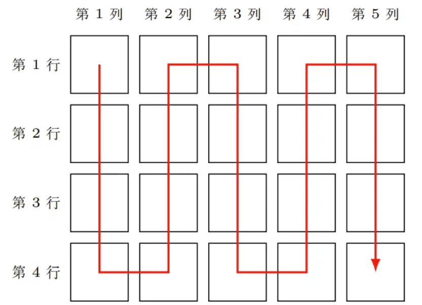

# P14358 [CSP-J 2025] 座位 / seat（官方数据）

https://www.luogu.com.cn/problem/P14358

## 题目描述

CSP-J 2025 第二轮正在进行。小 R 所在的考场共有 $n \times m$ 名考生，其中所有考生的 CSP-J 2025 第一轮成绩**互不相同**。所有 $n \times m$ 名考生将按照 CSP-J 2025 第一轮的成绩，**由高到低蛇形分配座位**，排列成 $n$ **行** $m$ **列**。具体地，设小 R 所在的考场的所有考生的成绩**从高到低**分别为 $s_1 > s_2 > \dots > s_{n \times m}$，则成绩为 $s_1$ 的考生的座位为第 1 **列**第 $1$ **行**，成绩为 $s_2$ 的考生的座位为第 $1$ **列**第 $2$ **行**，$\dots$，成绩为 $s_n$ 的考生的座位为第 $1$ **列**第 $n$ **行**，成绩为 $s_{n+1}$ 的考生的座位为第 $2$ **列**第 $n$ **行**，$\dots$，成绩为 $s_{2n}$ 的考生的座位为第 $2$ **列**第 $1$ **行**，成绩为 $s_{2n+1}$ 的考生的座位为第 $3$ **列**第 $1$ **行**，以此类推。

例如，若 $n = 4, m = 5$，则所有 $4 \times 5 = 20$ 名考生将按照 CSP-J 2025 第一轮成绩从高到低的顺序，根据下图中的箭头顺序分配座位。

:::align{center}

:::

给定小 R 所在的考场座位的**行数** $n$ 与**列数** $m$，以及小 R 所在的考场的所有考生 CSP-J 2025 第一轮的成绩 $a_1, a_2, \dots, a_{n \times m}$，其中 $a_1$ 为小 R CSP-J 2025 第一轮的成绩，你需要帮助小 R 求出，他的座位为第几**列**第几**行**。

## 输入格式

输入的第一行包含两个正整数 $n, m$，分别表示小 R 所在的考场座位的**行数**与**列数**。

输入的第二行包含 $n \times m$ 个正整数 $a_1, a_2, \dots, a_{n \times m}$，分别表示小 R 所在的考场的所有考生 CSP-J 2025 第一轮的成绩，其中 $a_1$ 为小 R CSP-J 2025 第一轮的成绩。

## 输出格式

输出一行两个正整数 $c, r$，表示小 R 的座位为第 $c$ **列**第 $r$ **行**。

## 输入输出样例 #1

### 输入 #1

```
2 2
99 100 97 98
```

### 输出 #1

```
1 2
```

## 输入输出样例 #2

### 输入 #2

```
2 2
98 99 100 97
```

### 输出 #2

```
2 2
```

## 输入输出样例 #3

### 输入 #3

```
3 3
94 95 96 97 98 99 100 93 92
```

### 输出 #3

```
3 1
```

## 说明/提示

### 【样例 1 解释】

按照成绩从高到低的顺序，成绩为 $100$ 的考生的座位为第 $1$ **列**第 $1$ **行**，成绩为 $99$ 的考生的座位为第 $1$ **列**第 $2$ **行**，成绩为 $98$ 的考生的座位为第 $2$ **列**第 $2$ **行**，成绩为 $97$ 的考生的座位为第 $2$ **列**第 $1$ **行**。小 R 的成绩为 $99$，因此座位为第 $1$ **列**第 $2$ **行**。

### 【样例 2 解释】

按照成绩从高到低的顺序，成绩为 $100$ 的考生的座位为第 $1$ **列**第 $1$ **行**，成绩为 $99$ 的考生的座位为第 $1$ **列**第 $2$ **行**，成绩为 $98$ 的考生的座位为第 $2$ **列**第 $2$ **行**，成绩为 $97$ 的考生的座位为第 $2$ **列**第 $1$ **行**。小 R 的成绩为 $98$，因此座位为第 $2$ **列**第 $2$ **行**。

### 【数据范围】

对于所有测试数据，保证：
- $1 \leq n \leq 10$, $1 \leq m \leq 10$;
- 对于所有 $1 \leq i \leq n \times m$，均有 $1 \leq a_i \leq 100$，且 $a_1, a_2, \dots, a_{n \times m}$ 互不相同。

::cute-table{tuack}

| 测试点编号 | $n \leq$ | $m \leq$ | 特殊性质 |
| :--: | :--: | :--: | :--: |
| $1$ | $1$ | $1$ | AB |
| $2, 3$ | ^ | $10$ | 无 |
| $4, 5$ | $10$ | $1$ | ^ |
| $6$ | $2$ | $2$ | A |
| $7$ | ^ | ^ | B |
| $8, 9$ | ^ | ^ | 无 |
| $10$ | ^ | $10$ | A |
| $11$ | ^ | ^ | B |
| $12 \sim 14$ | ^ | ^ | 无 |
| $15 \sim 17$ | $10$ | $2$ | ^ |
| $18 \sim 20$ | ^ | $10$ | ^ |

特殊性质 A：对于所有 $1 \leq i \leq n \times m$，均有 $a_i = i$。

特殊性质 B：对于所有 $1 \leq i \leq n \times m$，均有 $a_i = n \times m - i + 1$。

