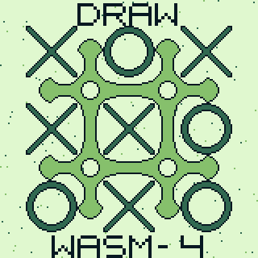

# WASM4 例子

A simple version of "Tic Tac Toe" (aka "noughts and crosses") using [WASM4](https://github.com/aduros/wasm4) and [Wa](https://wa-lang.org).

https://github.com/christopher-kleine/tic-tac-toe-wasm4
